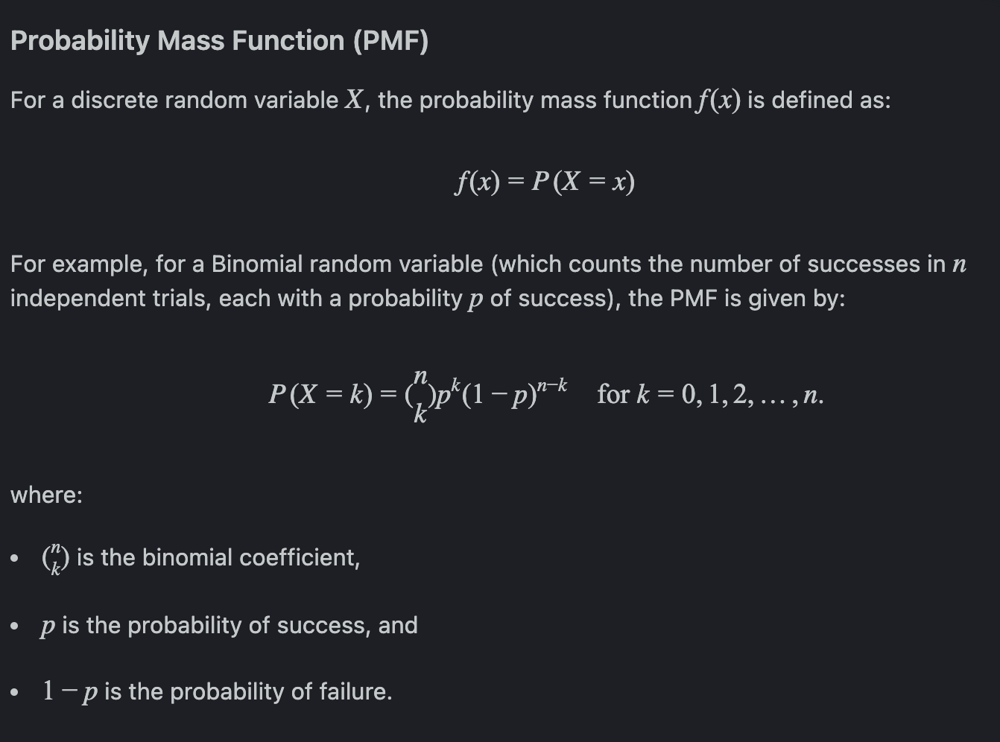

# provide a python example for test a probability density function and print the resutls and a suitable simple plot . provide a data dummy with it


Below is an example in Python that tests a probability density function (PDF) by computing and printing PDF values for a normal distribution and then plotting both the computed PDF and a histogram of some dummy data sampled from the same distribution.

### Python Code Example

```python:pdf_example.py
import numpy as np
import matplotlib.pyplot as plt
from scipy.stats import norm

def main():
    # Parameters for the normal distribution
    mu = 0       # Mean
    sigma = 1    # Standard Deviation

    # Create an array of x values from -5 to 5
    x = np.linspace(-5, 5, 1000)

    # Compute PDF values for the normal distribution at each x value
    pdf_values = norm.pdf(x, mu, sigma)

    # Print the first 5 x values and PDF values as a sample output
    print("First 5 x values:", x[:5])
    print("First 5 PDF values:", pdf_values[:5])

    # Plot the probability density function
    plt.figure(figsize=(8, 6))
    plt.plot(x, pdf_values, label=f'Normal PDF (μ={mu}, σ={sigma})')
    plt.title("Probability Density Function of a Normal Distribution")
    plt.xlabel("x")
    plt.ylabel("Probability Density")
    plt.legend()
    plt.grid(True)
    plt.show()

    # -------------------------------
    # Generate dummy data from the normal distribution
    dummy_data = np.random.normal(mu, sigma, 1000)
    print("\nDummy data sample (first 10 values):", dummy_data[:10])

    # Plot the histogram of the dummy data (normalized to form a density)
    # and overlay the theoretical normal PDF
    plt.figure(figsize=(8, 6))
    plt.hist(dummy_data, bins=30, density=True, alpha=0.6, color='g', label='Dummy Data Histogram')
    plt.plot(x, pdf_values, 'r-', lw=2, label='Normal PDF')
    plt.title("Dummy Data Histogram with Normal PDF")
    plt.xlabel("x")
    plt.ylabel("Density")
    plt.legend()
    plt.grid(True)
    plt.show()

if __name__ == "__main__":
    main()
```

### Explanation

1. **Importing Libraries**
   - `numpy` is used to create numerical arrays and generate dummy data.
   - `matplotlib.pyplot` is used to create plots.
   - `scipy.stats.norm` provides the PDF function for the normal distribution.

2. **Computing the PDF**
   - We define the parameters for the normal distribution with mean (`mu = 0`) and standard deviation (`sigma = 1`).
   - The `np.linspace` function is used to generate 1000 equally spaced x-values from -5 to 5.
   - The `norm.pdf(x, mu, sigma)` computes the probability density at each x-value.

3. **Printing the Results**
   - The first 5 values of the x-array and corresponding PDF values are printed to the console.

4. **Plotting the PDF**
   - A line plot of the PDF is created to visually show how probability density varies with x.

5. **Generating Dummy Data**
   - `np.random.normal` is used to generate 1000 dummy data points from the same normal distribution.

6. **Histogram Plot**
   - A histogram of the dummy data is plotted (using `density=True` to normalize the histogram) to approximate the underlying probability density.
   - The theoretical PDF is overlaid on the histogram to visually compare the sample distribution to the true distribution.

This example demonstrates how to compute, print, and visualize a continuous probability distribution using a probability density function in Python. Enjoy experimenting with the code!

# great, provide another example with an odd or skewed distribution (data)

Below is another Python example using an **exponential distribution**, which is a skewed (right-tailed) distribution. In this example, we compute the PDF values, print some of them, generate dummy data, and create corresponding plots.

### Python Code Example

```python:pdf_skewed_example.py
import numpy as np
import matplotlib.pyplot as plt
from scipy.stats import expon

def main():
    # Set the scale parameter for the exponential distribution.
    # The exponential distribution PDF is defined for x >= 0 as:
    # f(x) = (1/scale) * exp(-x/scale)
    scale = 1.0  # mean (and standard deviation for the exponential distribution)

    # Create an array of x values from 0 to 10.
    x = np.linspace(0, 10, 1000)

    # Compute the PDF values for the exponential distribution.
    pdf_values = expon.pdf(x, scale=scale)
    
    # Print the first 5 x values and their corresponding PDF values.
    print("First 5 x values:", x[:5])
    print("First 5 PDF values:", pdf_values[:5])
    
    # Plot the probability density function.
    plt.figure(figsize=(8, 6))
    plt.plot(x, pdf_values, label=f'Exponential PDF (scale={scale})', color='blue')
    plt.title("Probability Density Function of an Exponential Distribution")
    plt.xlabel("x")
    plt.ylabel("Probability Density")
    plt.legend()
    plt.grid(True)
    plt.show()

    # -------------------------------
    # Generate dummy data from the exponential distribution.
    dummy_data = np.random.exponential(scale, 1000)
    print("\nDummy data sample (first 10 values):", dummy_data[:10])
    
    # Plot the histogram of the dummy data (normalized as a density)
    # and overlay the theoretical exponential PDF.
    plt.figure(figsize=(8, 6))
    plt.hist(dummy_data, bins=30, density=True, alpha=0.6, color='green', label='Dummy Data Histogram')
    plt.plot(x, pdf_values, 'r-', lw=2, label='Exponential PDF')
    plt.title("Histogram of Dummy Data with Exponential PDF")
    plt.xlabel("x")
    plt.ylabel("Density")
    plt.legend()
    plt.grid(True)
    plt.show()

if __name__ == "__main__":
    main()
```

---

### Explanation

1. **Importing Libraries:**
   - `numpy` is used for numerical operations.
   - `matplotlib.pyplot` is used for plotting.
   - `scipy.stats.expon` provides functions for the exponential distribution.

2. **Computing the PDF:**
   - We set the scale parameter to 1.0. In an exponential distribution, this parameter is both the mean and standard deviation.
   - An array of x values ranging from 0 to 10 is created.
   - The PDF is calculated using `expon.pdf(x, scale=scale)`, which for the exponential distribution is defined as:
     \[
     f(x) = \frac{1}{\text{scale}} \exp\left(-\frac{x}{\text{scale}}\right) \quad \text{for } x \ge 0.
     \]
   - The first five values of x and the corresponding PDF values are printed.

3. **Plotting the PDF:**
   - A plot of the exponential PDF is drawn to visualize the skewness (a long tail to the right).

4. **Generating Dummy Data:**
   - Dummy data is generated using `np.random.exponential(scale, 1000)`, which samples 1000 data points from the exponential distribution.
   - The first ten values of the dummy data are printed.

5. **Histogram with PDF Overlay:**
   - A histogram of the dummy data is plotted with 30 bins. The histogram is normalized by setting `density=True` so that it can be directly compared to the theoretical PDF.
   - The theoretical exponential PDF is overlaid on the histogram, which allows you to see how well the sampled data approximates the continuous probability density function.

This example demonstrates how to work with a skewed distribution using a probability density function in Python.


# formula of the probability mass function and a python example




Below is an explanation of the probability mass function (PMF) along with a Python example.

---

### Probability Mass Function (PMF)

For a discrete random variable \(X\), the probability mass function \(f(x)\) is defined as:

\[
f(x) = P(X = x)
\]

For example, for a Binomial random variable (which counts the number of successes in \(n\) independent trials, each with a probability \(p\) of success), the PMF is given by:

\[
P(X = k) = \binom{n}{k} p^k (1-p)^{n-k} \quad \text{for } k = 0, 1, 2, \dots, n.
\]

where:
- \(\binom{n}{k}\) is the binomial coefficient,
- \(p\) is the probability of success, and
- \(1-p\) is the probability of failure.

---

### Python Example Using the Binomial Distribution

The following Python script demonstrates how to compute the PMF of a Binomial distribution, print the resulting values, generate dummy data by sampling from this distribution, and plot both the theoretical PMF and a histogram of the dummy data.

```python:pmf_example.py
import numpy as np
import matplotlib.pyplot as plt
from scipy.stats import binom

def main():
    # Parameters for the Binomial distribution
    n = 10    # number of trials
    p = 0.5   # probability of success

    # Generate the range of outcomes: 0 through n
    x = np.arange(0, n + 1)  # possible number of successes

    # Calculate the theoretical PMF for each outcome
    pmf_values = binom.pmf(x, n, p)
    
    # Print the outcomes and PMF values
    print("Possible outcomes (number of successes):", x)
    print("PMF values:", pmf_values)

    # Generate dummy data by sampling from the Binomial distribution
    dummy_data = np.random.binomial(n, p, size=1000)
    print("\nDummy data sample (first 10 values):", dummy_data[:10])
    
    # Plot the theoretical PMF
    plt.figure(figsize=(8, 6))
    plt.plot(x, pmf_values, 'bo', ms=8, label='Theoretical Binomial PMF')
    plt.vlines(x, 0, pmf_values, colors='b', lw=2, alpha=0.5)
    
    # Plot a normalized histogram of the dummy data
    plt.hist(dummy_data, bins=np.arange(-0.5, n+1.5, 1), density=True,
             alpha=0.6, color='orange', label='Dummy Data Histogram')
    
    plt.xlabel('Number of Successes')
    plt.ylabel('Probability')
    plt.title(f'Binomial Distribution PMF (n={n}, p={p})')
    plt.legend()
    plt.grid(True)
    plt.show()
    
if __name__ == "__main__":
    main()
```

---

### Explanation

1. **Defining the Parameters:**
   - We set \(n = 10\) (total trials) and \(p = 0.5\) (probability of success in each trial).

2. **Computing the PMF:**
   - The outcomes \(x\) are generated using `np.arange(0, n + 1)`.
   - The theoretical PMF is calculated with `binom.pmf(x, n, p)`.
   - The code prints the possible outcomes and their corresponding PMF values.

3. **Generating Dummy Data:**
   - We use `np.random.binomial(n, p, size=1000)` to generate 1000 samples from the Binomial distribution.
   - A sample of the dummy data is printed to the console.

4. **Plotting the Results:**
   - The theoretical PMF is plotted using blue markers and vertical lines.
   - A histogram of the dummy data (normalized as a probability distribution) is overlaid in orange.
   - The plot includes labels and a legend to clearly compare the theoretical PMF with the sampled data.

This example shows how to work with a probability mass function for a discrete distribution in Python. Enjoy experimenting with the code!
